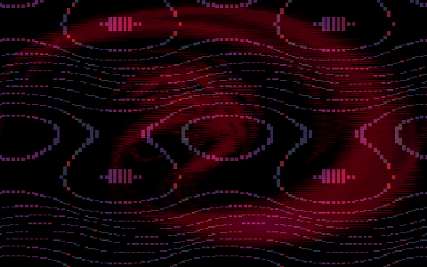

# Earthbound Screensaver

A native macOS screensaver that displays the iconic battle backgrounds from Earthbound/Mother 2, cycling through random combinations.



## Credits

This project is a thin wrapper around **[Earthbound Battle Backgrounds JS](https://github.com/gjtorikian/Earthbound-Battle-Backgrounds-JS)** by **[Garen Torikian](https://github.com/gjtorikian)** — all the rendering magic happens there.

Additional thanks to:
- **[@kdex](https://github.com/kdex)** — ES2016 rewrite of the engine
- **Mr. Accident** (forum.starmen.net) — Original C# implementation and distortion math
- **[liquidx](https://github.com/liquidx)** — WebViewScreenSaver (reference for macOS WKWebView fixes)
- **[CodeMan38](https://www.zone38.net/)** — [Press Start 2P](https://fonts.google.com/specimen/Press+Start+2P) font (SIL OFL 1.1)

## Features

- **52,650 Combinations**: Randomly cycles through all 327 layer styles in two-layer compositions
- **Native macOS App**: Standalone `.saver` bundle - no dependencies required
- **Configurable**: Adjust cycle timing via URL parameters
- **Offline**: Works completely without internet
- **Authentic**: Pixelated rendering preserves the retro SNES aesthetic
- **Sonoma/Sequoia Compatible**: Includes fixes for macOS 14+ blank screen issues

## Installation

### Option 1: Download Pre-built Release (Easiest)

1. Download the latest `EarthboundScreensaver.saver.zip` from [Releases](../../releases)
2. Unzip and double-click the `.saver` file to install
3. **If macOS blocks installation:** Right-click the `.saver` file → **Open** → **Open** again to bypass Gatekeeper (the screensaver is not notarized)
4. Open **System Settings** → **Screen Saver** → click **Show All** → select **Earthbound Screensaver**

### Option 2: Build from Source

Requires:
- Node.js 24+ ([install with nvm](https://github.com/nvm-sh/nvm))
- Xcode (for native build)
- [Task](https://taskfile.dev) (`brew install go-task`)

```bash
# Clone and build
git clone https://github.com/sjmatta/earthbound-screensaver.git
cd earthbound-screensaver

# Build and install
task install

# Or step by step:
task setup    # Build web assets
task build    # Build native .saver bundle
task install  # Install to ~/Library/Screen Savers
```

### Available Tasks

```bash
task              # Show all available tasks
task install      # Build and install screensaver
task run          # Install and launch for testing
task logs         # Stream screensaver logs (for debugging)
task check        # Run diagnostics
task clean        # Remove build artifacts
task help:macos   # Show macOS screensaver development tips
```

## Configuration

Customize behavior by editing `src/screensaver.js` before building, or via URL parameters if using the web version:

| Parameter | Default | Description |
|-----------|---------|-------------|
| `interval` | `60` | Seconds between background changes |

## Project Structure

```
earthbound-screensaver/
├── Taskfile.yml              # Build tasks (run with `task`)
├── assets/
│   └── demo.gif              # README animation
├── src/
│   ├── index.html            # HTML entry point
│   └── main.js               # Screensaver logic
├── native/
│   └── EarthboundScreensaver/
│       ├── EarthboundScreensaverView.swift  # Native wrapper
│       └── Info.plist
├── dist/                     # Built output (generated)
│   └── EarthboundScreensaver.saver
└── CLAUDE.md                 # Development notes
```

## Troubleshooting

### Blank/Black Screen on macOS Sonoma/Sequoia

This is a known issue with WKWebView in screensavers on macOS 14+. The native `.saver` bundle includes the fix. If you're using the web version with WebViewScreenSaver, ensure you have version 2.3+.

### Screensaver Not Appearing

Third-party screensavers are hidden in macOS Sequoia:
1. Open **System Settings** → **Screen Saver**
2. Scroll down and click **Show All**
3. Look in the "Other" section

### Debugging

```bash
task logs        # Stream live logs
task logs:errors # Show recent errors
task check       # Run diagnostics
task kill-processes  # Clear cached processes after rebuilding
```

## How It Works

This screensaver uses [Earthbound Battle Backgrounds JS](https://github.com/gjtorikian/Earthbound-Battle-Backgrounds-JS) by Garen Torikian to render the backgrounds. The build process:

1. Clones the upstream project
2. Patches it for offline `file://` compatibility
3. Builds and extracts needed assets
4. Wraps in a native macOS `.saver` bundle with WKWebView

The native wrapper includes critical fixes for macOS Sonoma/Sequoia compatibility (disabling WKWebView window occlusion detection).

## License

MIT License - see [LICENSE](LICENSE)

Third-party licenses are listed in [NOTICES](NOTICES).

This project is not affiliated with Nintendo, Ape, HAL Laboratory, or Shigesato Itoi.
