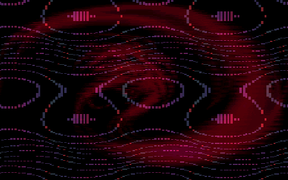

# EarthBound Screensaver

EarthBound's battle backgrounds as an offline macOS screensaver, with a native preview app for finding your favorites.



## Features

- **224 original pairings** with encounter names derived from the game's battle-group data.
- **Remix mode** combines any of the 327 raw layers and crossfades between scenes.
- **Deterministic animation** implements scrolling sequences, distortion durations, wrapping integer arithmetic, sine-table scanline effects, and frame-based palette cycles.
- **Display choices**: 4:3, integer source-pixel scaling, or full-screen stretch.
- **Background Studio**: searchable thumbnails, favorites, exclusions, and a live native WKWebView preview.
- **Offline and universal**: self-contained Intel/Apple Silicon builds.
- **Two hosts**: the established `.saver` wrapper and an experimental app-extension target embedded in Studio.

“Authentic pairings” means pairings taken from the game data. The renderer is disassembly-based, but has not been compared with emulator captures and does not simulate the whole battle engine. See [fidelity and validation details](docs/renderer.md).

## Build and preview

Requires Node.js 24+, Xcode, and [Task](https://taskfile.dev). Local validation used Xcode 26.6 and macOS 26.5.2. Studio and its experimental extension target macOS 14+.

```sh
git clone https://github.com/sjmatta/earthbound-macos-screensaver.git
cd earthbound-macos-screensaver
task preview
```

Useful commands:

```sh
task build             # dist/EarthboundScreensaver.saver
task build:studio      # dist/EarthboundStudio.app, including experimental .appex
task install           # install the legacy .saver in ~/Library/Screen Savers
npm test               # state, renderer, selection, and built-page startup checks
scripts/test-native.sh # repeated-stop and cross-display restart checks
npm run dev            # browser development; add ?preview=true for the gallery
```

Builds use the committed Xcode projects. XcodeGen is only needed to regenerate the Studio project after editing `native/studio.yml` (`task project:studio`). Building/opening Studio does not change the selected system screensaver. Keep one app location when experimenting with extension registration; macOS caches extension locations.

## Configure

In Studio, choose a collection, display mode, interval, and whether to show names. Search the gallery to favorite or exclude a pairing. Clicking a scene holds it in the preview; **Next background** resumes rotation. With no available favorites, Favorites only falls back to the non-excluded collection. Excluding everything leaves a black frame until a scene is restored.

Studio saves to the legacy saver's preferences domain. The legacy options sheet also exposes collection, display, interval, names, and Favorites only. The experimental extension provides the full gallery in its options window; its sandbox preference sharing remains subject to host-level validation.

For browser use, add URL parameters:

| Parameter | Example | Meaning |
| --- | --- | --- |
| `preview` | `true` | Show Studio controls and gallery |
| `mode` | `authentic` or `remix` | Original pairings or arbitrary combinations |
| `scale` | `4:3`, `pixels`, `fill` | Display scaling |
| `interval` | `60` | Seconds per scene, clamped to 5–300 |
| `showLayerNames` | `false` | Hide overlays |
| `layer1`, `layer2` | `269`, `270` | Pin a pair and disable automatic cycling |
| `frame` | `120` | Render a fixed simulation frame for inspection |
| `debug` | `true` | Keep the name overlay visible |

## Installation and macOS compatibility

Build and run `task install` to install the legacy saver. On Tahoe, select it through **System Settings → Wallpaper → Screen Saver**. Earlier versions have a separate Screen Saver pane. Local bundles use ad-hoc signing; Developer ID notarization has not been performed.

Legacy WKWebView screensavers have documented OS lifecycle and display issues. This project keeps its occlusion and dismissal workarounds. The new extension uses private Apple APIs and is **experimental**; successful compilation and native preview rendering do not establish lock-screen, multi-monitor, or future-OS compatibility. [Current implementation notes](docs/renderer.md), [September research review](docs/2026-09-06-review.md).

## Rendering checks

Capture a scene without running a browser:

```sh
npm run capture -- 269 270 120 output/capture
node scripts/compare-frames.mjs output/capture.rgba reference.rgba
node scripts/benchmark.mjs
```

Capture emits raw RGBA8, a PPM image, and source/frame metadata. It is an implementation capture, not independent emulator evidence. The [renderer guide](docs/renderer.md) explains reference alignment and remaining fidelity boundaries.

## Credits

The ROM graphics/arrangement decoder and bundled background data come from [EarthBound Battle Backgrounds JS](https://github.com/gjtorikian/Earthbound-Battle-Backgrounds-JS) by Garen Torikian, with contributions from kdex and the original work by Mr. Accident. Animation and encounter metadata use [Herringway/ebsrc](https://github.com/Herringway/ebsrc). The experimental host follows [AppexSaverMinimal](https://github.com/AerialScreensaver/AppexSaverMinimal) by Guillaume Louel. Thanks also to [WebViewScreenSaver](https://github.com/liquidx/webviewscreensaver) and CodeMan38's Press Start 2P font.

MIT for the project code; see [LICENSE](LICENSE) and [NOTICES](NOTICES) for attribution and third-party material. EarthBound / Mother 2 and the original game assets belong to their respective rights holders. This project is not affiliated with Nintendo, Ape, HAL Laboratory, or Shigesato Itoi.
